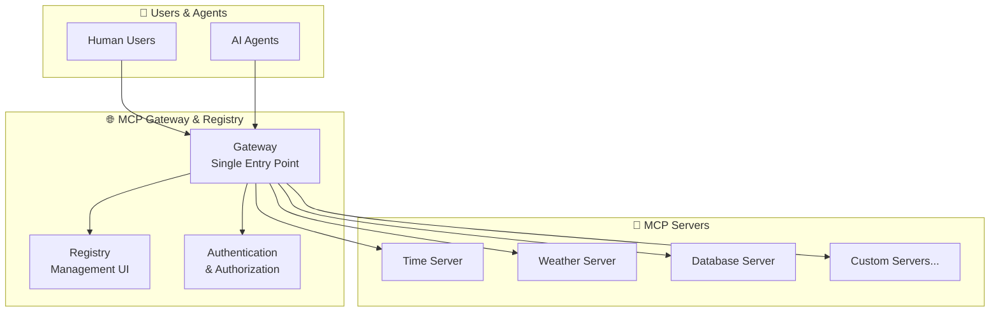

# MCP Gateway & Registry

## What is MCP Gateway & Registry?

The [Model Context Protocol (MCP)](https://modelcontextprotocol.io/introduction) lets AI agents use external tools and data sources. However, enterprises face critical challenges when deploying MCP at scale:

- **🔍 Discovery Challenge**: How do agents find and access approved MCP servers?
- **🔒 Security Challenge**: How do you control access to sensitive tools and data?
- **⚙️ Management Challenge**: How do you govern hundreds of MCP servers across teams?

**MCP Gateway & Registry solves this** by providing a unified platform that combines centralized access control with intelligent tool discovery. Think of it as a "single front door" to all your organization's MCP tools with enterprise-grade security.

| Resource | Link |
|----------|------|
| **Demo Video** | _coming soon_ |
| **Blog Post** | [How the MCP Gateway Centralizes Your AI Model's Tools](https://community.aws/content/2xmhMS0eVnA10kZA0eES46KlyMU/how-the-mcp-gateway-centralizes-your-ai-model-s-tools) |

---

## 🚀 Quick Start (5 Minutes)

Get MCP Gateway running locally without any AWS setup:

```bash
# Clone and start the demo
git clone https://github.com/agentic-community/mcp-gateway-registry.git
cd mcp-gateway-registry
./quick-demo.sh  # Starts with sample data, no authentication required
```

**What you'll see:**
- Registry web interface at `http://localhost:7860`
- Sample MCP servers (time, weather, calculator)
- Tool discovery and management interface
- Example AI agent interactions

> **Note**: This demo uses mock authentication. For production deployment with real security, see [Production Deployment](#production-deployment).

---

## 📋 For Decision Makers

### Deployment Options

| Scenario | Setup | Complexity | Time | Best For |
|----------|-------|------------|------|----------|
| **Evaluation** | Local Docker | 🟢 Low | 5 min | Trying out the solution |
| **Development** | EC2 + HTTP | 🟡 Medium | 30 min | Development teams |
| **Production** | EC2/EKS + HTTPS | 🔴 High | 2-4 hours | Enterprise deployment |

### Key Capabilities

- **🔧 Unified Tool Access**: Single endpoint for all MCP servers
- **🛡️ Enterprise Security**: Integration with Amazon Cognito, fine-grained access control
- **🔍 Smart Discovery**: AI agents can find tools using natural language queries
- **📊 Management Interface**: Web UI for server registration and monitoring
- **⚡ Dynamic Scaling**: Support for both local and cloud-deployed MCP servers
- **🔄 Health Monitoring**: Automatic health checks and status reporting

### Architecture Overview



---

## 🛠️ Getting Started

### Prerequisites

Choose your deployment scenario:

#### For Local Development/Evaluation
- Docker and Docker Compose
- 8GB RAM recommended
- No AWS account required

#### For Production Deployment
- AWS Account with EC2 access
- Domain name (recommended for HTTPS)
- SSL certificate (for production security)

### Installation Options

#### Option 1: Quick Demo (Recommended for First-Time Users)

```bash
# Start local demo with sample data
git clone https://github.com/agentic-community/mcp-gateway-registry.git
cd mcp-gateway-registry
./quick-demo.sh
```

**✅ Validation**: Visit `http://localhost:7860` - you should see the registry interface with sample MCP servers.

#### Option 2: Local Development Setup

```bash
# Clone repository
git clone https://github.com/agentic-community/mcp-gateway-registry.git
cd mcp-gateway-registry

# Configure for local development
cp .env.template .env.local
# Edit .env.local - set ADMIN_PASSWORD and enable dev mode
echo "ENABLE_DEV_MODE=true" >> .env.local
echo "ADMIN_PASSWORD=your-secure-password" >> .env.local

# Start services
./build_and_run.sh --env-file .env.local
```

**✅ Validation**: 
1. Check all services are running: `docker-compose ps`
2. Access registry: `http://localhost:7860`
3. Login with username: `admin`, password: `your-secure-password`

#### Option 3: Production Deployment

For production deployment with full authentication and security, see [Production Deployment Guide](#production-deployment).

---

## 💡 Usage Examples

### Web Interface Usage

1. **Access the Registry**: Navigate to `http://localhost:7860`
2. **Explore MCP Servers**: View available servers, their tools, and health status
3. **Manage Services**: Enable/disable servers, register new ones, check health
4. **Discover Tools**: Use the search feature to find tools by natural language description


### Programmatic Access

Connect your AI agents to the gateway:

```python
import mcp
from mcp.client.sse import sse_client

# Connect to MCP Gateway
server_url = "http://localhost:8080/currenttime/sse"

async with sse_client(server_url) as (read, write):
    async with mcp.ClientSession(read, write) as session:
        # Initialize connection
        await session.initialize()
        
        # List available tools
        tools = await session.list_tools()
        print(f"Available tools: {[tool.name for tool in tools.tools]}")
        
        # Call a tool
        result = await session.call_tool("current_time_by_timezone", 
                                       arguments={"timezone": "America/New_York"})
        print(f"Current time: {result.content[0].text}")
```

### Adding New MCP Servers

**Via Web Interface:**
1. Click "Register Server" in the registry UI
2. Provide server details (name, URL, description)
3. Configure access permissions
4. Test connection and save

**Via Configuration File:**
```json
{
  "name": "my-custom-server",
  "path": "/my-server",
  "proxy_pass": "http://localhost:8005",
  "description": "My custom MCP server",
  "enabled": true
}
```

---

## 🏗️ Architecture & Design

The Gateway uses an [Nginx reverse proxy](https://docs.nginx.com/nginx/admin-guide/web-server/reverse-proxy/) architecture where each MCP server is accessible via a unique path. This design supports both SSE and Streamable HTTP transports while providing a single entry point for all MCP services.

### Detailed Architecture

```mermaid
flowchart TB
    subgraph Human_Users["Human Users"]
        User1["Human User 1"]
        User2["Human User 2"]
        UserN["Human User N"]
    end

    subgraph AI_Agents["AI Agents"]
        Agent1["AI Agent 1"]
        Agent2["AI Agent 2"]
        Agent3["AI Agent 3"]
        AgentN["AI Agent N"]
    end

    subgraph EC2_Gateway["<b>MCP Gateway & Registry</b> (Amazon EC2 Instance)"]
        subgraph NGINX["NGINX Reverse Proxy"]
            RP["Reverse Proxy Router"]
        end
        
        subgraph AuthRegistry["Authentication & Registry Services"]
            AuthServer["Auth Server<br/>(Dual Auth)"]
            Registry["Registry<br/>Web UI"]
            RegistryMCP["Registry<br/>MCP Server"]
        end
        
        subgraph LocalMCPServers["Local MCP Servers"]
            MCP_Local1["MCP Server 1"]
            MCP_Local2["MCP Server 2"]
        end
    end
    
    %% Identity Provider
    IdP[Identity Provider<br/>Amazon Cognito]
    
    subgraph EKS_Cluster["Amazon EKS/EC2 Cluster"]
        MCP_EKS1["MCP Server 3"]
        MCP_EKS2["MCP Server 4"]
    end
    
    subgraph APIGW_Lambda["Amazon API Gateway + AWS Lambda"]
        API_GW["Amazon API Gateway"]
        Lambda1["AWS Lambda Function 1"]
        Lambda2["AWS Lambda Function 2"]
    end
    
    subgraph External_Systems["External Data Sources & APIs"]
        DB1[(Database 1)]
        DB2[(Database 2)]
        API1["External API 1"]
        API2["External API 2"]
        API3["External API 3"]
    end
    
    %% Connections from Human Users
    User1 -->|Web Browser<br>Authentication| IdP
    User2 -->|Web Browser<br>Authentication| IdP
    UserN -->|Web Browser<br>Authentication| IdP
    User1 -->|Web Browser<br>HTTPS| Registry
    User2 -->|Web Browser<br>HTTPS| Registry
    UserN -->|Web Browser<br>HTTPS| Registry
    
    %% Connections from Agents to Gateway
    Agent1 -->|MCP Protocol<br>SSE with Auth| RP
    Agent2 -->|MCP Protocol<br>SSE with Auth| RP
    Agent3 -->|MCP Protocol<br>Streamable HTTP with Auth| RP
    AgentN -->|MCP Protocol<br>Streamable HTTP with Auth| RP
    
    %% Auth flow connections
    RP -->|Auth validation| AuthServer
    AuthServer -.->|Validate credentials| IdP
    Registry -.->|User authentication| IdP
    RP -->|Tool discovery| RegistryMCP
    RP -->|Web UI access| Registry
    
    %% Connections from Gateway to MCP Servers
    RP -->|SSE| MCP_Local1
    RP -->|SSE| MCP_Local2
    RP -->|SSE| MCP_EKS1
    RP -->|SSE| MCP_EKS2
    RP -->|Streamable HTTP| API_GW
    
    %% Connections within API GW + Lambda
    API_GW --> Lambda1
    API_GW --> Lambda2
    
    %% Connections to External Systems
    MCP_Local1 -->|Tool Connection| DB1
    MCP_Local2 -->|Tool Connection| DB2
    MCP_EKS1 -->|Tool Connection| API1
    MCP_EKS2 -->|Tool Connection| API2
    Lambda1 -->|Tool Connection| API3

    %% Style definitions
    classDef user fill:#fff9c4,stroke:#f57f17,stroke-width:2px
    classDef agent fill:#e1f5fe,stroke:#29b6f6,stroke-width:2px
    classDef gateway fill:#e8f5e9,stroke:#66bb6a,stroke-width:2px
    classDef nginx fill:#f3e5f5,stroke:#ab47bc,stroke-width:2px
    classDef mcpServer fill:#fff3e0,stroke:#ffa726,stroke-width:2px
    classDef eks fill:#ede7f6,stroke:#7e57c2,stroke-width:2px
    classDef apiGw fill:#fce4ec,stroke:#ec407a,stroke-width:2px
    classDef lambda fill:#ffebee,stroke:#ef5350,stroke-width:2px
    classDef dataSource fill:#e3f2fd,stroke:#2196f3,stroke-width:2px
    
    %% Apply styles
    class User1,User2,UserN user
    class Agent1,Agent2,Agent3,AgentN agent
    class EC2_Gateway,NGINX gateway
    class RP nginx
    class AuthServer,Registry,RegistryMCP gateway
    class IdP apiGw
    class MCP_Local1,MCP_Local2 mcpServer
    class EKS_Cluster,MCP_EKS1,MCP_EKS2 eks
    class API_GW apiGw
    class Lambda1,Lambda2 lambda
    class DB1,DB2,API1,API2,API3 dataSource
```



### Key Features

*   **🔍 MCP Tool Discovery**: Enables automatic tool discovery by AI Agents using natural language queries (e.g. _"do I have tools to get stock information?"_)
*   **🌐 Unified Access**: Access multiple MCP servers through a single gateway endpoint
*   **📝 Service Registration**: Register MCP services via JSON files or web UI/API
*   **🖥️ Management Interface**: Web UI for service management, monitoring, and health checks
*   **🔐 Enterprise Authentication**: Secure login with Amazon Cognito integration
*   **💓 Health Monitoring**: Automatic health checks with real-time status updates
*   **⚙️ Dynamic Configuration**: Auto-generated Nginx configuration based on registered services
*   **🎨 Modern UI**: Dark/light theme support with responsive design

---

## 🚀 Production Deployment

### Security Checklist

Before deploying to production, ensure you have:

- [ ] **SSL Certificate**: Valid certificate for your domain
- [ ] **Amazon Cognito Setup**: User pools and app clients configured
- [ ] **Security Groups**: Proper firewall rules (ports 443, 8080)
- [ ] **Environment Variables**: All secrets properly configured
- [ ] **Access Control**: Fine-grained permissions configured
- [ ] **Monitoring**: Health checks and alerting set up

### EC2 Production Deployment

#### Step 1: Infrastructure Setup

1. **Launch EC2 Instance**:
   - Instance type: `t3.2xlarge` or larger
   - AMI: Ubuntu 22.04 LTS
   - Security group: Allow ports 80, 443, 8080

2. **Configure Domain & SSL**:
   ```bash
   # Place SSL certificates
   sudo mkdir -p /home/ubuntu/ssl_data/{certs,private}
   # Copy your certificate files to these directories
   ```

#### Step 2: Authentication Setup

1. **Configure Amazon Cognito** (see [detailed guide](docs/cognito.md)):
   - Create user pool
   - Configure app client
   - Set up user groups and permissions

2. **Configure Environment**:
   ```bash
   cp .env.template .env
   # Edit .env with your Cognito settings:
   # COGNITO_USER_POOL_ID=your-pool-id
   # COGNITO_CLIENT_ID=your-client-id
   # COGNITO_CLIENT_SECRET=your-client-secret
   # AWS_REGION=your-region
   ```

#### Step 3: Deploy Services

```bash
# Deploy with production configuration
./build_and_run.sh

# Verify deployment
docker-compose ps
curl -k https://your-domain.com/health
```

**✅ Production Validation**:
1. SSL certificate is valid and trusted
2. Authentication redirects to Cognito
3. All MCP servers are accessible via HTTPS
4. Health checks are passing
5. Logs show no errors

### EKS Production Deployment

For Kubernetes deployment, see the [EKS deployment guide](https://github.com/aws-samples/amazon-eks-machine-learning-with-terraform-and-kubeflow/tree/master/examples/agentic/mcp-gateway-registry).

### Production Operations

#### Monitoring

**Key Metrics to Track**:
- Gateway response times
- MCP server health status
- Authentication success/failure rates
- Tool discovery query performance

**Health Check Endpoints**:
- Gateway: `https://your-domain.com/health`
- Registry: `https://your-domain.com:7860/health`
- Individual servers: `https://your-domain.com/server-name/health`

#### Security

**Access Review Process**:
1. Regularly audit Cognito user groups
2. Review scope configurations in `auth_server/scopes.yml`
3. Monitor authentication logs for anomalies
4. Update SSL certificates before expiration

**Backup Strategy**:
- Configuration files: `auth_server/scopes.yml`, `.env`
- Server registry: `registry/server_state.json`
- SSL certificates and keys

#### Scaling

**Performance Characteristics**:
- Gateway can handle 1000+ concurrent connections
- Registry supports 100+ registered MCP servers
- Tool discovery scales with FAISS index size

**Scaling Bottlenecks**:
- Nginx connection limits
- Authentication token validation
- MCP server response times

---

## 🔧 Advanced Configuration

### Authentication Modes

The system supports two authentication modes:

#### User Identity Mode
Agents act on behalf of users using OAuth 2.0 PKCE flow:

```bash
# Configure user authentication
cp agents/.env.template agents/.env.user
# Edit with Cognito settings

# Authenticate user
python agents/cli_user_auth.py

# Run agent with user identity
python agents/agent.py --use-session-cookie --message "what time is it?"
```

#### Agent Identity Mode
Agents use their own Machine-to-Machine credentials:

```bash
# Configure agent authentication
cp agents/.env.template agents/.env.agent
# Edit with agent credentials

# Run agent with its own identity
python agents/agent.py --message "what time is it?"
```

### Fine-Grained Access Control

Configure detailed permissions in [`auth_server/scopes.yml`](auth_server/scopes.yml):

```yaml
# Example: Restrict user to specific tools
group_mappings:
  mcp-registry-analyst:
    - mcp-servers-restricted/read
    - mcp-servers-restricted/execute

mcp-servers-restricted/execute:
  - server: fininfo
    methods: [initialize, tools/list, tools/call]
    tools: [get_stock_aggregates, print_stock_data]
```

For comprehensive configuration details, see:
- [Authentication Guide](docs/auth.md)
- [Cognito Setup](docs/cognito.md)
- [Scopes Configuration](docs/scopes.md)

---

## 🗺️ What's New

* **🆔 IdP Integration with Amazon Cognito**: Complete identity provider integration supporting both user identity and agent identity modes
* **🔒 Fine-Grained Access Control (FGAC)**: Granular permissions system for precise control over server and tool access
* **🤝 Strands Agents Integration**: Enhanced agent capabilities with the [Strands SDK](https://github.com/strands-agents/sdk-python)
* **🧠 Dynamic Tool Discovery**: AI agents can autonomously discover and execute tools using semantic search with FAISS indexing
* **☸️ Kubernetes Support**: Deploy on Amazon EKS for production environments

---

## 🛣️ Roadmap

1. **Enhanced Storage**: Persistent storage for server configurations and metadata
2. **GitHub Integration**: Automatic server information retrieval via GitHub API
3. **Deployment Automation**: One-click MCP server deployment capabilities
4. **Advanced Analytics**: Usage analytics and performance insights
5. **Multi-Cloud Support**: Support for Azure and GCP identity providers

---

## 📄 License

This project is licensed under the Apache-2.0 License.

---

## 🆘 Troubleshooting

### Common Issues

#### "Cannot connect to registry"
- **Check**: Is Docker running? `docker-compose ps`
- **Check**: Are ports available? `netstat -tulpn | grep :7860`
- **Solution**: Restart services with `docker-compose restart`

#### "Authentication failed"
- **Check**: Cognito configuration in `.env` file
- **Check**: User exists in correct Cognito group
- **Solution**: Verify credentials and group membership

#### "MCP server not responding"
- **Check**: Server health in registry UI
- **Check**: Server logs with `docker-compose logs server-name`
- **Solution**: Restart specific server or check server configuration

For detailed troubleshooting, see individual documentation files in the [`docs/`](docs/) directory.

---

## 📚 Additional Resources

- [Model Context Protocol Documentation](https://modelcontextprotocol.io/introduction)
- [Authentication & Authorization Guide](docs/auth.md)
- [Amazon Cognito Setup Guide](docs/cognito.md)
- [Fine-Grained Access Control](docs/scopes.md)
- [EKS Deployment Guide](https://github.com/aws-samples/amazon-eks-machine-learning-with-terraform-and-kubeflow/tree/master/examples/agentic/mcp-gateway-registry)
