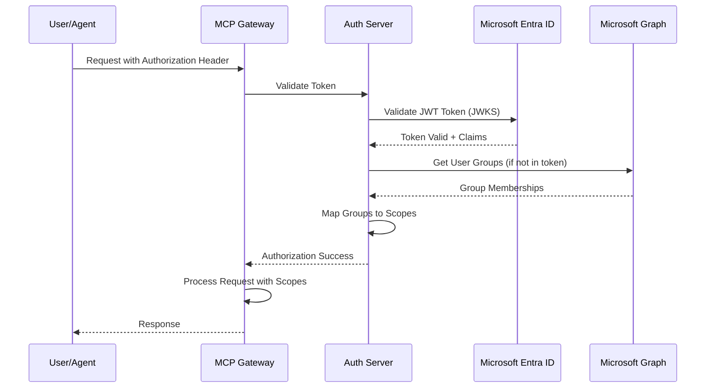
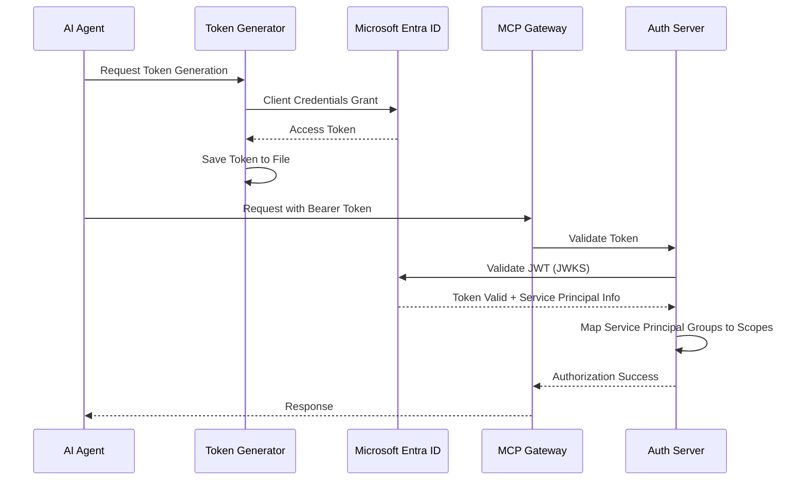

# Microsoft Entra ID Implementation Guide for MCP Gateway

## Overview

This document outlines the technical implementation details, code changes, and architectural modifications required to integrate Microsoft Entra ID (formerly Azure Active Directory) as an identity provider for the MCP Gateway. This implementation follows the same provider pattern as the existing Keycloak integration.

## Table of Contents

1. [Architecture Overview](#architecture-overview)
2. [Provider Implementation](#provider-implementation)
3. [Code Changes Required](#code-changes-required)
4. [Environment Variables](#environment-variables)
5. [Token Management](#token-management)
6. [Authentication Flow](#authentication-flow)
7. [Group Mapping](#group-mapping)
8. [Testing Implementation](#testing-implementation)
9. [Migration Considerations](#migration-considerations)
10. [Security Considerations](#security-considerations)

## Architecture Overview

### Current Authentication Architecture

The MCP Gateway uses a pluggable authentication provider system with the following components:

```
┌─────────────────┐    ┌──────────────────┐    ┌─────────────────┐
│   AI Agent      │    │   Auth Server    │    │   Identity      │
│                 │    │                  │    │   Provider      │
│  ┌───────────┐  │    │  ┌────────────┐  │    │                 │
│  │ MCP Client│──┼────┼──│ Provider   │──┼────┼─ Keycloak       │
│  └───────────┘  │    │  │ Factory    │  │    │                 │
│                 │    │  └────────────┘  │    │ OR              │
└─────────────────┘    │                  │    │                 │
                       │  ┌────────────┐  │    │ Microsoft       │
                       │  │ JWT        │  │    │ Entra ID        │
                       │  │ Validation │  │    │                 │
                       │  └────────────┘  │    │                 │
                       └──────────────────┘    └─────────────────┘
```

### Entra ID Integration

The implementation will add an `EntraIdProvider` class that implements the same `AuthProvider` interface:

```python
# Current structure
auth_server/providers/
├── __init__.py
├── base.py          # AuthProvider interface
├── factory.py       # Provider factory
├── cognito.py       # Amazon Cognito provider
├── keycloak.py      # Keycloak provider
└── entra.py         # Microsoft Entra ID provider
```

## Provider Implementation

### Step 1: Create Entra ID Provider Class

Create `auth_server/providers/entra.py`:

```python
"""Microsoft Entra ID authentication provider implementation."""

import json
import logging
import time
from functools import lru_cache
from typing import Any, Dict, List, Optional
from urllib.parse import urlencode

import jwt
import requests
from msal import ConfidentialClientApplication

from .base import AuthProvider

logger = logging.getLogger(__name__)


class EntraIdProvider(AuthProvider):
    """Microsoft Entra ID authentication provider implementation."""

    def __init__(
        self,
        tenant_id: str,
        client_id: str,
        client_secret: str,
        cloud_instance: str = "https://login.microsoftonline.com",
        m2m_client_id: Optional[str] = None,
        m2m_client_secret: Optional[str] = None
    ):
        """Initialize Entra ID provider.

        Args:
            tenant_id: Azure tenant ID
            client_id: OAuth2 client ID for web authentication
            client_secret: OAuth2 client secret for web authentication
            cloud_instance: Azure cloud instance URL (defaults to public cloud)
            m2m_client_id: Optional M2M client ID (defaults to client_id)
            m2m_client_secret: Optional M2M client secret (defaults to client_secret)
        """
        self.tenant_id = tenant_id
        self.client_id = client_id
        self.client_secret = client_secret
        self.cloud_instance = cloud_instance.rstrip('/')
        self.m2m_client_id = m2m_client_id or client_id
        self.m2m_client_secret = m2m_client_secret or client_secret

        # Authority and endpoints
        self.authority = f"{self.cloud_instance}/{tenant_id}"
        self.token_endpoint = f"{self.authority}/oauth2/v2.0/token"
        self.auth_endpoint = f"{self.authority}/oauth2/v2.0/authorize"
        self.userinfo_endpoint = "https://graph.microsoft.com/v1.0/me"
        self.logout_endpoint = f"{self.authority}/oauth2/v2.0/logout"

        # JWKS endpoint for token validation
        self.jwks_endpoint = f"{self.authority}/discovery/v2.0/keys"

        # MSAL client for advanced scenarios
        self.msal_app = ConfidentialClientApplication(
            client_id=self.client_id,
            client_credential=self.client_secret,
            authority=self.authority
        )

        # Cache for JWKS and configuration
        self._jwks_cache: Optional[Dict[str, Any]] = None
        self._jwks_cache_time: float = 0
        self._jwks_cache_ttl: int = 3600  # 1 hour

        logger.debug(f"Initialized Entra ID provider for tenant '{tenant_id}' at {cloud_instance}")

    def validate_token(
        self,
        token: str,
        **kwargs: Any
    ) -> Dict[str, Any]:
        """Validate Entra ID JWT token."""
        try:
            logger.debug("Validating Entra ID JWT token")

            # Get JWKS for validation
            jwks = self.get_jwks()

            # Decode token header to get key ID
            unverified_header = jwt.get_unverified_header(token)
            kid = unverified_header.get('kid')

            if not kid:
                raise ValueError("Token missing 'kid' in header")

            # Find matching key
            signing_key = None
            for key in jwks.get('keys', []):
                if key.get('kid') == kid:
                    from jwt import PyJWK
                    signing_key = PyJWK(key).key
                    break

            if not signing_key:
                raise ValueError(f"No signing key found for kid: {kid}")

            # Validate token
            decoded_token = jwt.decode(
                token,
                signing_key,
                algorithms=["RS256"],
                audience=self.client_id,
                issuer=f"{self.authority}/v2.0"
            )

            # Extract user information
            username = decoded_token.get('preferred_username') or decoded_token.get('upn') or decoded_token.get('sub')
            email = decoded_token.get('email') or decoded_token.get('upn')

            # Extract groups (if present in token)
            groups = decoded_token.get('groups', [])

            # If groups are not in token, fetch from Graph API
            if not groups and 'scp' in decoded_token:
                groups = self._get_user_groups_from_graph(token)

            logger.info(f"✅ Token validation successful using EntraIdProvider for user: {username}")

            return {
                'valid': True,
                'username': username,
                'email': email,
                'groups': groups,
                'scopes': decoded_token.get('scp', '').split() if decoded_token.get('scp') else [],
                'client_id': decoded_token.get('aud'),
                'method': 'entra_jwt',
                'data': decoded_token
            }

        except jwt.ExpiredSignatureError:
            logger.warning("Token has expired")
            raise ValueError("Token has expired")
        except jwt.InvalidTokenError as e:
            logger.warning(f"Invalid token: {e}")
            raise ValueError(f"Invalid token: {e}")
        except Exception as e:
            logger.error(f"Error validating Entra ID token: {e}")
            raise ValueError(f"Token validation failed: {e}")

    def get_jwks(self) -> Dict[str, Any]:
        """Get JSON Web Key Set for token validation."""
        current_time = time.time()

        # Return cached JWKS if still valid
        if (self._jwks_cache and
            current_time - self._jwks_cache_time < self._jwks_cache_ttl):
            return self._jwks_cache

        try:
            logger.debug(f"Fetching JWKS from {self.jwks_endpoint}")
            response = requests.get(self.jwks_endpoint, timeout=10)
            response.raise_for_status()

            jwks = response.json()

            # Cache the JWKS
            self._jwks_cache = jwks
            self._jwks_cache_time = current_time

            logger.debug("JWKS fetched and cached successfully")
            return jwks

        except Exception as e:
            logger.error(f"Failed to fetch JWKS: {e}")
            raise ValueError(f"Unable to fetch JWKS: {e}")

    def exchange_code_for_token(
        self,
        code: str,
        redirect_uri: str
    ) -> Dict[str, Any]:
        """Exchange authorization code for access token."""
        try:
            # Use MSAL for token exchange
            result = self.msal_app.acquire_token_by_authorization_code(
                code,
                scopes=["https://graph.microsoft.com/.default"],
                redirect_uri=redirect_uri
            )

            if "error" in result:
                raise ValueError(f"Token exchange failed: {result.get('error_description', result.get('error'))}")

            return {
                'access_token': result['access_token'],
                'id_token': result.get('id_token'),
                'refresh_token': result.get('refresh_token'),
                'token_type': 'Bearer',
                'expires_in': result.get('expires_in', 3600)
            }

        except Exception as e:
            logger.error(f"Error exchanging code for token: {e}")
            raise ValueError(f"Code exchange failed: {e}")

    def get_user_info(
        self,
        access_token: str
    ) -> Dict[str, Any]:
        """Get user information from access token."""
        try:
            headers = {'Authorization': f'Bearer {access_token}'}
            response = requests.get(self.userinfo_endpoint, headers=headers, timeout=10)
            response.raise_for_status()

            user_info = response.json()

            # Get user groups
            groups_endpoint = "https://graph.microsoft.com/v1.0/me/memberOf"
            groups_response = requests.get(groups_endpoint, headers=headers, timeout=10)
            groups_response.raise_for_status()

            groups_data = groups_response.json()
            groups = [group['id'] for group in groups_data.get('value', []) if group.get('@odata.type') == '#microsoft.graph.group']

            return {
                'username': user_info.get('userPrincipalName'),
                'email': user_info.get('mail') or user_info.get('userPrincipalName'),
                'groups': groups,
                'display_name': user_info.get('displayName'),
                'object_id': user_info.get('id')
            }

        except Exception as e:
            logger.error(f"Error getting user info: {e}")
            raise ValueError(f"Failed to get user info: {e}")

    def get_auth_url(
        self,
        redirect_uri: str,
        state: str,
        scope: Optional[str] = None
    ) -> str:
        """Get authorization URL for OAuth2 flow."""
        scopes = scope.split() if scope else ["openid", "profile", "email", "https://graph.microsoft.com/User.Read"]

        auth_url = self.msal_app.get_authorization_request_url(
            scopes=scopes,
            redirect_uri=redirect_uri,
            state=state
        )

        return auth_url

    def get_logout_url(
        self,
        redirect_uri: str
    ) -> str:
        """Get logout URL."""
        params = {
            'post_logout_redirect_uri': redirect_uri
        }
        return f"{self.logout_endpoint}?{urlencode(params)}"

    def refresh_token(
        self,
        refresh_token: str
    ) -> Dict[str, Any]:
        """Refresh an access token using a refresh token."""
        try:
            result = self.msal_app.acquire_token_by_refresh_token(
                refresh_token,
                scopes=["https://graph.microsoft.com/.default"]
            )

            if "error" in result:
                raise ValueError(f"Token refresh failed: {result.get('error_description', result.get('error'))}")

            return {
                'access_token': result['access_token'],
                'id_token': result.get('id_token'),
                'refresh_token': result.get('refresh_token'),
                'token_type': 'Bearer',
                'expires_in': result.get('expires_in', 3600)
            }

        except Exception as e:
            logger.error(f"Error refreshing token: {e}")
            raise ValueError(f"Token refresh failed: {e}")

    def validate_m2m_token(
        self,
        token: str
    ) -> Dict[str, Any]:
        """Validate a machine-to-machine token."""
        # M2M tokens from Entra ID are validated the same way as user tokens
        return self.validate_token(token)

    def get_m2m_token(
        self,
        client_id: Optional[str] = None,
        client_secret: Optional[str] = None,
        scope: Optional[str] = None
    ) -> Dict[str, Any]:
        """Get a machine-to-machine token using client credentials."""
        try:
            # Use provided credentials or fall back to defaults
            m2m_id = client_id or self.m2m_client_id
            m2m_secret = client_secret or self.m2m_client_secret

            # Create M2M MSAL app if using different credentials
            if client_id and client_secret:
                m2m_app = ConfidentialClientApplication(
                    client_id=m2m_id,
                    client_credential=m2m_secret,
                    authority=self.authority
                )
            else:
                m2m_app = self.msal_app

            # Default scope for M2M
            scopes = [scope] if scope else ["https://graph.microsoft.com/.default"]

            result = m2m_app.acquire_token_for_client(scopes=scopes)

            if "error" in result:
                raise ValueError(f"M2M token acquisition failed: {result.get('error_description', result.get('error'))}")

            return {
                'access_token': result['access_token'],
                'token_type': 'Bearer',
                'expires_in': result.get('expires_in', 3600)
            }

        except Exception as e:
            logger.error(f"Error getting M2M token: {e}")
            raise ValueError(f"M2M token acquisition failed: {e}")

    def _get_user_groups_from_graph(self, access_token: str) -> List[str]:
        """Get user groups from Microsoft Graph API."""
        try:
            headers = {'Authorization': f'Bearer {access_token}'}
            groups_endpoint = "https://graph.microsoft.com/v1.0/me/memberOf"

            response = requests.get(groups_endpoint, headers=headers, timeout=10)
            response.raise_for_status()

            groups_data = response.json()
            groups = [group['id'] for group in groups_data.get('value', []) if group.get('@odata.type') == '#microsoft.graph.group']

            logger.debug(f"Retrieved {len(groups)} groups from Graph API")
            return groups

        except Exception as e:
            logger.warning(f"Failed to get user groups from Graph API: {e}")
            return []

    def get_provider_info(self) -> Dict[str, Any]:
        """Get provider information for health checks."""
        return {
            'provider_type': 'entra',
            'tenant_id': self.tenant_id,
            'authority': self.authority,
            'status': 'healthy'
        }
```

### Step 2: Update Provider Factory

Modify `auth_server/providers/factory.py`:

```python
# Add import
from .entra import EntraIdProvider

def get_auth_provider(
    provider_type: Optional[str] = None
) -> AuthProvider:
    """Factory function to get the appropriate auth provider."""
    provider_type = provider_type or os.environ.get('AUTH_PROVIDER', 'cognito')

    logger.info(f"Creating authentication provider: {provider_type}")

    if provider_type == 'keycloak':
        return _create_keycloak_provider()
    elif provider_type == 'cognito':
        return _create_cognito_provider()
    elif provider_type == 'entra':
        return _create_entra_provider()
    else:
        raise ValueError(f"Unknown auth provider: {provider_type}")

def _create_entra_provider() -> EntraIdProvider:
    """Create and configure Entra ID provider."""
    # Required configuration
    tenant_id = os.environ.get('ENTRA_TENANT_ID')
    client_id = os.environ.get('ENTRA_CLIENT_ID')
    client_secret = os.environ.get('ENTRA_CLIENT_SECRET')

    # Optional configuration
    cloud_instance = os.environ.get('ENTRA_CLOUD_INSTANCE', 'https://login.microsoftonline.com')
    m2m_client_id = os.environ.get('ENTRA_M2M_CLIENT_ID')
    m2m_client_secret = os.environ.get('ENTRA_M2M_CLIENT_SECRET')

    # Validate required configuration
    missing_vars = []
    if not tenant_id:
        missing_vars.append('ENTRA_TENANT_ID')
    if not client_id:
        missing_vars.append('ENTRA_CLIENT_ID')
    if not client_secret:
        missing_vars.append('ENTRA_CLIENT_SECRET')

    if missing_vars:
        raise ValueError(
            f"Missing required Entra ID configuration: {', '.join(missing_vars)}. "
            "Please set these environment variables."
        )

    logger.info(f"Initializing Entra ID provider for tenant '{tenant_id}' at {cloud_instance}")

    return EntraIdProvider(
        tenant_id=tenant_id,
        client_id=client_id,
        client_secret=client_secret,
        cloud_instance=cloud_instance,
        m2m_client_id=m2m_client_id,
        m2m_client_secret=m2m_client_secret
    )
```

## Code Changes Required

### Step 3: Update Dependencies

Add required dependencies to `pyproject.toml`:

```toml
[project]
dependencies = [
    # ... existing dependencies
    "msal>=1.24.0",  # Microsoft Authentication Library
    "requests>=2.31.0",
    "pyjwt[crypto]>=2.8.0"
]
```

### Step 4: Update Scopes Configuration

Modify `auth_server/scopes.yml` to include Entra ID group mappings:

```yaml
# Group mappings from identity provider groups to MCP scopes
group_mappings:
  # Cognito groups (existing)
  mcp-servers-unrestricted:
    - mcp-servers-unrestricted/read
    - mcp-servers-unrestricted/execute

  mcp-servers-restricted:
    - mcp-servers-restricted/read
    - mcp-servers-restricted/execute

  # Keycloak groups (existing)
  mcp-servers-unrestricted:
    - mcp-servers-unrestricted/read
    - mcp-servers-unrestricted/execute

  mcp-servers-restricted:
    - mcp-servers-restricted/read
    - mcp-servers-restricted/execute

  # Entra ID groups (NEW - use Object IDs from Azure)
  "aaaaaaaa-bbbb-cccc-dddd-eeeeeeeeeeee":  # mcp-servers-unrestricted Object ID
    - mcp-servers-unrestricted/read
    - mcp-servers-unrestricted/execute

  "ffffffff-gggg-hhhh-iiii-jjjjjjjjjjjj":  # mcp-servers-restricted Object ID
    - mcp-servers-restricted/read
    - mcp-servers-restricted/execute

  "kkkkkkkk-llll-mmmm-nnnn-oooooooooooo":  # mcp-admins Object ID
    - mcp-servers-unrestricted/read
    - mcp-servers-unrestricted/execute
    - mcp-registry/admin
```

### Step 5: Create Credentials Provider

Create `credentials-provider/entra/generate_tokens.py`:

```python
"""Generate Entra ID tokens for MCP Gateway agents."""

import argparse
import json
import logging
import os
import sys
from datetime import datetime, timedelta
from pathlib import Path
from typing import Dict, Any, Optional

import requests
from msal import ConfidentialClientApplication

# Configure logging
logging.basicConfig(
    level=logging.INFO,
    format="%(asctime)s,p%(process)s,{%(filename)s:%(lineno)d},%(levelname)s,%(message)s",
)
logger = logging.getLogger(__name__)

class EntraTokenGenerator:
    """Generate and manage Entra ID tokens for agents."""

    def __init__(self):
        """Initialize token generator with environment configuration."""
        self.tenant_id = os.environ.get('ENTRA_TENANT_ID')
        self.cloud_instance = os.environ.get('ENTRA_CLOUD_INSTANCE', 'https://login.microsoftonline.com')

        if not self.tenant_id:
            raise ValueError("ENTRA_TENANT_ID environment variable is required")

        self.authority = f"{self.cloud_instance}/{self.tenant_id}"

        # Token storage directory
        self.token_dir = Path('.oauth-tokens')
        self.token_dir.mkdir(exist_ok=True)

    def generate_agent_token(self, agent_id: str) -> Dict[str, Any]:
        """Generate token for specific agent."""
        logger.info(f"Generating Entra ID token for agent: {agent_id}")

        # Load agent configuration
        agent_config = self._load_agent_config(agent_id)

        # Create MSAL client for agent
        app = ConfidentialClientApplication(
            client_id=agent_config['client_id'],
            client_credential=agent_config['client_secret'],
            authority=self.authority
        )

        # Acquire token using client credentials flow
        result = app.acquire_token_for_client(
            scopes=["https://graph.microsoft.com/.default"]
        )

        if "error" in result:
            raise ValueError(f"Token generation failed: {result.get('error_description', result.get('error'))}")

        # Calculate expiration time
        expires_in = result.get('expires_in', 3600)
        expires_at = datetime.utcnow() + timedelta(seconds=expires_in)

        # Create token data
        token_data = {
            'access_token': result['access_token'],
            'token_type': 'Bearer',
            'expires_in': expires_in,
            'expires_at': expires_at.timestamp(),
            'expires_at_human': expires_at.isoformat() + 'Z',
            'agent_id': agent_id,
            'provider': 'entra',
            'client_id': agent_config['client_id'],
            'tenant_id': self.tenant_id,
            'generated_at': datetime.utcnow().isoformat() + 'Z'
        }

        # Save token to file
        token_file = self.token_dir / f"agent-{agent_id}-m2m-token.json"
        with open(token_file, 'w') as f:
            json.dump(token_data, f, indent=2)

        logger.info(f"Token generated and saved to: {token_file}")
        logger.info(f"Token expires at: {token_data['expires_at_human']}")

        return token_data

    def _load_agent_config(self, agent_id: str) -> Dict[str, str]:
        """Load agent configuration from file or environment."""
        # Try to load from JSON file first
        config_file = self.token_dir / f"agent-{agent_id}-m2m.json"

        if config_file.exists():
            with open(config_file, 'r') as f:
                return json.load(f)

        # Fall back to environment variables
        client_id = os.environ.get(f'ENTRA_AGENT_{agent_id.upper().replace("-", "_")}_CLIENT_ID')
        client_secret = os.environ.get(f'ENTRA_AGENT_{agent_id.upper().replace("-", "_")}_CLIENT_SECRET')

        if not client_id or not client_secret:
            raise ValueError(
                f"Agent configuration not found for '{agent_id}'. "
                f"Create {config_file} or set environment variables "
                f"ENTRA_AGENT_{agent_id.upper().replace('-', '_')}_CLIENT_ID and "
                f"ENTRA_AGENT_{agent_id.upper().replace('-', '_')}_CLIENT_SECRET"
            )

        return {
            'client_id': client_id,
            'client_secret': client_secret,
            'tenant_id': self.tenant_id
        }

    def generate_all_agents(self) -> None:
        """Generate tokens for all configured agents."""
        logger.info("Generating tokens for all configured agents")

        # Find all agent configuration files
        agent_configs = list(self.token_dir.glob("agent-*-m2m.json"))

        if not agent_configs:
            logger.warning("No agent configurations found in .oauth-tokens/")
            return

        for config_file in agent_configs:
            # Extract agent ID from filename
            agent_id = config_file.stem.replace("agent-", "").replace("-m2m", "")

            try:
                self.generate_agent_token(agent_id)
            except Exception as e:
                logger.error(f"Failed to generate token for agent '{agent_id}': {e}")


def main():
    """Main entry point."""
    parser = argparse.ArgumentParser(description='Generate Entra ID tokens for MCP Gateway agents')
    parser.add_argument('--agent-id', type=str, help='Specific agent ID to generate token for')
    parser.add_argument('--all-agents', action='store_true', help='Generate tokens for all configured agents')

    args = parser.parse_args()

    if not args.agent_id and not args.all_agents:
        parser.error("Either --agent-id or --all-agents must be specified")

    try:
        generator = EntraTokenGenerator()

        if args.all_agents:
            generator.generate_all_agents()
        else:
            generator.generate_agent_token(args.agent_id)

        logger.info("Token generation completed successfully")

    except Exception as e:
        logger.error(f"Token generation failed: {e}")
        sys.exit(1)


if __name__ == "__main__":
    main()
```

### Step 6: Update Docker Configuration

Modify `docker-compose.yml` to support Entra ID:

```yaml
version: '3.8'

services:
  auth-server:
    build: ./auth_server
    environment:
      # Provider selection
      - AUTH_PROVIDER=${AUTH_PROVIDER:-cognito}

      # Cognito configuration (existing)
      - COGNITO_USER_POOL_ID=${COGNITO_USER_POOL_ID}
      - COGNITO_CLIENT_ID=${COGNITO_CLIENT_ID}
      - COGNITO_CLIENT_SECRET=${COGNITO_CLIENT_SECRET}
      - AWS_REGION=${AWS_REGION}

      # Keycloak configuration (existing)
      - KEYCLOAK_URL=${KEYCLOAK_URL}
      - KEYCLOAK_REALM=${KEYCLOAK_REALM}
      - KEYCLOAK_CLIENT_ID=${KEYCLOAK_CLIENT_ID}
      - KEYCLOAK_CLIENT_SECRET=${KEYCLOAK_CLIENT_SECRET}

      # Entra ID configuration
      - ENTRA_TENANT_ID=${ENTRA_TENANT_ID}
      - ENTRA_CLIENT_ID=${ENTRA_CLIENT_ID}
      - ENTRA_CLIENT_SECRET=${ENTRA_CLIENT_SECRET}
      - ENTRA_CLOUD_INSTANCE=${ENTRA_CLOUD_INSTANCE:-https://login.microsoftonline.com}
      - ENTRA_M2M_CLIENT_ID=${ENTRA_M2M_CLIENT_ID}
      - ENTRA_M2M_CLIENT_SECRET=${ENTRA_M2M_CLIENT_SECRET}

      # Group mappings for Entra ID
      - ENTRA_GROUP_UNRESTRICTED_ID=${ENTRA_GROUP_UNRESTRICTED_ID}
      - ENTRA_GROUP_RESTRICTED_ID=${ENTRA_GROUP_RESTRICTED_ID}
      - ENTRA_GROUP_ADMINS_ID=${ENTRA_GROUP_ADMINS_ID}
    ports:
      - "8000:8000"
    volumes:
      - ./auth_server/scopes.yml:/app/scopes.yml
    networks:
      - mcp-network

  mcpgw-server:
    build: ./servers/mcpgw
    environment:
      - AUTH_PROVIDER=${AUTH_PROVIDER:-cognito}
      - ENTRA_TENANT_ID=${ENTRA_TENANT_ID}
    depends_on:
      - auth-server
    ports:
      - "7860:7860"
    networks:
      - mcp-network

networks:
  mcp-network:
    driver: bridge
```

## Environment Variables

### Required Environment Variables

```bash
# Authentication Provider Selection
AUTH_PROVIDER=entra

# Microsoft Entra ID Core Configuration
ENTRA_TENANT_ID=12345678-1234-1234-1234-123456789012
ENTRA_CLIENT_ID=87654321-4321-4321-4321-210987654321
ENTRA_CLIENT_SECRET=your_client_secret_here

# Optional: Azure Cloud Configuration (defaults to public cloud)
ENTRA_CLOUD_INSTANCE=https://login.microsoftonline.com

# Optional: M2M Configuration (defaults to main client)
ENTRA_M2M_CLIENT_ID=your_m2m_client_id
ENTRA_M2M_CLIENT_SECRET=your_m2m_client_secret

# Group Mappings (Azure AD Group Object IDs)
ENTRA_GROUP_UNRESTRICTED_ID=aaaaaaaa-bbbb-cccc-dddd-eeeeeeeeeeee
ENTRA_GROUP_RESTRICTED_ID=ffffffff-gggg-hhhh-iiii-jjjjjjjjjjjj
ENTRA_GROUP_ADMINS_ID=kkkkkkkk-llll-mmmm-nnnn-oooooooooooo

# Optional: Cache and Performance Settings
ENTRA_TOKEN_CACHE_TTL=300
ENTRA_JWKS_CACHE_TTL=3600
ENTRA_DEBUG=false
```

### Agent-Specific Environment Variables

For each AI agent service principal:

```bash
# Example for SRE Agent
ENTRA_AGENT_SRE_AGENT_CLIENT_ID=agent_sp_client_id
ENTRA_AGENT_SRE_AGENT_CLIENT_SECRET=agent_sp_client_secret

# Example for Travel Assistant
ENTRA_AGENT_TRAVEL_ASSISTANT_CLIENT_ID=travel_sp_client_id
ENTRA_AGENT_TRAVEL_ASSISTANT_CLIENT_SECRET=travel_sp_client_secret
```

## Token Management

### Token File Structure

Entra ID tokens are stored in the same format as Keycloak tokens:

```json
{
  "access_token": "eyJ0eXAiOiJKV1QiLCJhbGciOiJSUzI1NiIs...",
  "token_type": "Bearer",
  "expires_in": 3599,
  "expires_at": 1640998800.123,
  "expires_at_human": "2021-12-31T23:00:00Z",
  "agent_id": "sre-agent",
  "provider": "entra",
  "client_id": "87654321-4321-4321-4321-210987654321",
  "tenant_id": "12345678-1234-1234-1234-123456789012",
  "generated_at": "2021-12-31T22:00:00Z"
}
```

### Token Refresh Service

Update the existing token refresh service to support Entra ID:

```python
# In credentials-provider/token_refresher.py
def refresh_entra_token(agent_id: str) -> Dict[str, Any]:
    """Refresh Entra ID token for agent."""
    from entra.generate_tokens import EntraTokenGenerator

    generator = EntraTokenGenerator()
    return generator.generate_agent_token(agent_id)

def refresh_token_for_provider(agent_id: str, provider: str) -> Dict[str, Any]:
    """Refresh token based on provider type."""
    if provider == 'keycloak':
        return refresh_keycloak_token(agent_id)
    elif provider == 'entra':
        return refresh_entra_token(agent_id)
    elif provider == 'cognito':
        return refresh_cognito_token(agent_id)
    else:
        raise ValueError(f"Unknown provider: {provider}")
```

## Authentication Flow

### OAuth2 Authorization Code Flow



### M2M (Client Credentials) Flow



## Group Mapping

### Mapping Entra ID Groups to MCP Scopes

The group mapping logic needs to handle Entra ID group Object IDs:

```python
def map_entra_groups_to_scopes(groups: List[str]) -> List[str]:
    """
    Map Entra ID group Object IDs to MCP scopes.

    Args:
        groups: List of Azure AD group Object IDs

    Returns:
        List of MCP scopes
    """
    scopes = []
    group_mappings = SCOPES_CONFIG.get('group_mappings', {})

    for group_id in groups:
        if group_id in group_mappings:
            group_scopes = group_mappings[group_id]
            scopes.extend(group_scopes)
            logger.debug(f"Mapped Entra group '{group_id}' to scopes: {group_scopes}")
        else:
            logger.debug(f"No scope mapping found for Entra group: {group_id}")

    # Remove duplicates while preserving order
    seen = set()
    unique_scopes = []
    for scope in scopes:
        if scope not in seen:
            seen.add(scope)
            unique_scopes.append(scope)

    logger.info(f"✅ Mapped Entra groups {groups} to scopes: {unique_scopes}")
    return unique_scopes
```

## Testing Implementation

### Step 1: Create Test Scripts

Create `test-entra-mcp.sh`:

```bash
#!/bin/bash
# Test Entra ID authentication with MCP Gateway

set -e

# Configuration
AGENT_ID="${1:-test-agent}"
MCP_GATEWAY_URL="${MCP_GATEWAY_URL:-http://localhost:7860}"
AUTH_SERVER_URL="${AUTH_SERVER_URL:-http://localhost:8000}"

echo "Testing Entra ID authentication for agent: $AGENT_ID"

# Check if token file exists
TOKEN_FILE=".oauth-tokens/agent-${AGENT_ID}-m2m-token.json"
if [ ! -f "$TOKEN_FILE" ]; then
    echo "❌ Token file not found: $TOKEN_FILE"
    echo "Generate token first: uv run python credentials-provider/entra/generate_tokens.py --agent-id $AGENT_ID"
    exit 1
fi

# Extract token from file
ACCESS_TOKEN=$(jq -r '.access_token' "$TOKEN_FILE")
if [ "$ACCESS_TOKEN" = "null" ] || [ -z "$ACCESS_TOKEN" ]; then
    echo "❌ No access token found in $TOKEN_FILE"
    exit 1
fi

echo "✅ Token file found: $TOKEN_FILE"

# Test token validation with auth server
echo "Testing token validation..."
VALIDATION_RESPONSE=$(curl -s -X POST "$AUTH_SERVER_URL/validate" \
    -H "X-Authorization: Bearer $ACCESS_TOKEN" \
    -H "Content-Type: application/json" \
    -w "HTTP_STATUS:%{http_code}")

HTTP_STATUS=$(echo "$VALIDATION_RESPONSE" | sed -n 's/.*HTTP_STATUS://p')
RESPONSE_BODY=$(echo "$VALIDATION_RESPONSE" | sed 's/HTTP_STATUS:.*$//')

if [ "$HTTP_STATUS" = "200" ]; then
    echo "✅ Token validation successful"
    echo "Response: $RESPONSE_BODY"
else
    echo "❌ Token validation failed (HTTP $HTTP_STATUS)"
    echo "Response: $RESPONSE_BODY"
    exit 1
fi

# Test MCP Gateway authentication
echo "Testing MCP Gateway authentication..."
MCP_RESPONSE=$(curl -s -X POST "$MCP_GATEWAY_URL/mcp" \
    -H "X-Authorization: Bearer $ACCESS_TOKEN" \
    -H "X-User-Pool-Id: entra-${ENTRA_TENANT_ID}" \
    -H "X-Client-Id: $AGENT_ID" \
    -H "X-Region: global" \
    -H "Content-Type: application/json" \
    -d '{"jsonrpc": "2.0", "method": "ping", "id": 1}' \
    -w "HTTP_STATUS:%{http_code}")

MCP_HTTP_STATUS=$(echo "$MCP_RESPONSE" | sed -n 's/.*HTTP_STATUS://p')
MCP_RESPONSE_BODY=$(echo "$MCP_RESPONSE" | sed 's/HTTP_STATUS:.*$//')

if [ "$MCP_HTTP_STATUS" = "200" ]; then
    echo "✅ MCP Gateway authentication successful"
    echo "Response: $MCP_RESPONSE_BODY"
else
    echo "❌ MCP Gateway authentication failed (HTTP $MCP_HTTP_STATUS)"
    echo "Response: $MCP_RESPONSE_BODY"
    exit 1
fi

echo "✅ All tests passed! Entra ID authentication is working correctly."
```

### Step 2: Unit Tests

Create `tests/test_entra_provider.py`:

```python
"""Unit tests for Entra ID authentication provider."""

import json
import pytest
from unittest.mock import Mock, patch, MagicMock
from auth_server.providers.entra import EntraIdProvider


class TestEntraIdProvider:
    """Test cases for EntraIdProvider."""

    @pytest.fixture
    def provider(self):
        """Create test provider instance."""
        return EntraIdProvider(
            tenant_id="test-tenant-id",
            client_id="test-client-id",
            client_secret="test-client-secret"
        )

    @pytest.fixture
    def mock_jwt_token(self):
        """Mock JWT token payload."""
        return {
            "aud": "test-client-id",
            "iss": "https://login.microsoftonline.com/test-tenant-id/v2.0",
            "iat": 1640995200,
            "nbf": 1640995200,
            "exp": 1640998800,
            "sub": "user-object-id",
            "preferred_username": "test@company.com",
            "email": "test@company.com",
            "upn": "test@company.com",
            "groups": ["group-id-1", "group-id-2"],
            "scp": "User.Read Group.Read.All"
        }

    def test_provider_initialization(self, provider):
        """Test provider initialization."""
        assert provider.tenant_id == "test-tenant-id"
        assert provider.client_id == "test-client-id"
        assert provider.authority == "https://login.microsoftonline.com/test-tenant-id"

    @patch('auth_server.providers.entra.requests.get')
    def test_get_jwks_success(self, mock_get, provider):
        """Test successful JWKS retrieval."""
        # Mock JWKS response
        mock_response = Mock()
        mock_response.json.return_value = {
            "keys": [
                {
                    "kid": "test-key-id",
                    "kty": "RSA",
                    "use": "sig",
                    "n": "test-n-value",
                    "e": "AQAB"
                }
            ]
        }
        mock_response.raise_for_status.return_value = None
        mock_get.return_value = mock_response

        jwks = provider.get_jwks()

        assert "keys" in jwks
        assert len(jwks["keys"]) == 1
        assert jwks["keys"][0]["kid"] == "test-key-id"
        mock_get.assert_called_once()

    @patch('auth_server.providers.entra.jwt.decode')
    @patch('auth_server.providers.entra.jwt.get_unverified_header')
    @patch.object(EntraIdProvider, 'get_jwks')
    def test_validate_token_success(self, mock_get_jwks, mock_get_header, mock_jwt_decode, provider, mock_jwt_token):
        """Test successful token validation."""
        # Mock JWT header
        mock_get_header.return_value = {"kid": "test-key-id"}

        # Mock JWKS
        mock_get_jwks.return_value = {
            "keys": [
                {
                    "kid": "test-key-id",
                    "kty": "RSA",
                    "use": "sig",
                    "n": "test-n-value",
                    "e": "AQAB"
                }
            ]
        }

        # Mock JWT decode
        mock_jwt_decode.return_value = mock_jwt_token

        with patch('auth_server.providers.entra.PyJWK') as mock_pyjwk:
            mock_key = Mock()
            mock_pyjwk.return_value.key = mock_key

            result = provider.validate_token("test-token")

            assert result["valid"] is True
            assert result["username"] == "test@company.com"
            assert result["email"] == "test@company.com"
            assert result["groups"] == ["group-id-1", "group-id-2"]
            assert result["method"] == "entra_jwt"

    @patch('auth_server.providers.entra.jwt.decode')
    def test_validate_token_expired(self, mock_jwt_decode, provider):
        """Test validation with expired token."""
        from jwt import ExpiredSignatureError
        mock_jwt_decode.side_effect = ExpiredSignatureError("Token has expired")

        with pytest.raises(ValueError, match="Token has expired"):
            provider.validate_token("expired-token")

    @patch.object(EntraIdProvider, '_create_msal_app')
    def test_get_m2m_token_success(self, mock_create_app, provider):
        """Test successful M2M token acquisition."""
        # Mock MSAL app
        mock_app = Mock()
        mock_app.acquire_token_for_client.return_value = {
            "access_token": "test-access-token",
            "token_type": "Bearer",
            "expires_in": 3600
        }
        mock_create_app.return_value = mock_app

        result = provider.get_m2m_token()

        assert result["access_token"] == "test-access-token"
        assert result["token_type"] == "Bearer"
        assert result["expires_in"] == 3600

    @patch.object(EntraIdProvider, '_create_msal_app')
    def test_get_m2m_token_error(self, mock_create_app, provider):
        """Test M2M token acquisition error."""
        # Mock MSAL app with error
        mock_app = Mock()
        mock_app.acquire_token_for_client.return_value = {
            "error": "invalid_client",
            "error_description": "Client authentication failed"
        }
        mock_create_app.return_value = mock_app

        with pytest.raises(ValueError, match="M2M token acquisition failed"):
            provider.get_m2m_token()
```

## Provider Selection

The MCP Gateway supports multiple identity providers. Choose the one that best fits your organization:

- **Microsoft Entra ID**: For organizations using Azure AD and Microsoft 365
- **Keycloak**: For organizations wanting self-hosted identity management
- **Amazon Cognito**: For AWS-native deployments

Each provider is independently configured - you only need to set up one based on your requirements. The authentication architecture remains consistent across all providers.

## Security Considerations

### Token Security
- Entra ID tokens have shorter default lifetimes (1 hour vs Keycloak's configurable lifetime)
- Implement token refresh every 30 minutes to ensure continuous operation
- Use certificate-based authentication for production environments

### Network Security
- Ensure outbound HTTPS access to `login.microsoftonline.com` and `graph.microsoft.com`
- Configure firewall rules to allow only necessary Microsoft endpoints
- Use Azure Private Link for enhanced security in Azure environments

### Access Control
- Use Azure AD Conditional Access policies to restrict access
- Implement device compliance requirements for admin accounts
- Enable MFA for all user accounts accessing the system

### Audit and Compliance
- All authentication events are logged with user and service principal identification
- Azure AD sign-in logs provide additional audit trail
- Implement log forwarding to SIEM systems for compliance requirements

### Secret Management
- Store client secrets in Azure Key Vault in production
- Rotate client secrets every 6 months
- Use managed identities where possible to eliminate stored secrets

---

## Summary

This implementation guide provides a complete blueprint for integrating Microsoft Entra ID with the MCP Gateway. The modular provider architecture ensures seamless integration while maintaining compatibility with existing Keycloak and Cognito providers.

Key benefits of this implementation:
- ✅ Enterprise-grade authentication with Azure AD integration
- ✅ Individual AI agent audit trails through service principals
- ✅ Group-based authorization with Azure AD security groups
- ✅ Seamless token management and refresh capabilities
- ✅ Full compatibility with existing MCP Gateway architecture
- ✅ Comprehensive testing and validation procedures

The implementation follows Azure best practices and enterprise security standards, making it suitable for production deployment in enterprise environments.